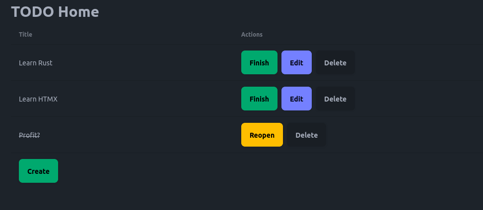

# HARM (HTMX, Axum, Rust, Maud) Stack Template

Full list of technologies used:

- Rust
- Axum: for web framework
- Diesel: for database
- Maud: for HTML templating
- dotenvy: for loading environment variables
- Snafu: for error handling
- Tailwind CSS (with DaisyUI): for styling
- (optional) Bacon + tower-livereload: for live reloading

## Screenshot



## Development

### Prerequisites

- Make sure that you have `rustc` and `cargo` installed (ideally by
  using [rustup](https://rustup.rs/)).
- To work with Diesel, you should have `diesel_cli` available (the binary can be
  installed by `cargo install diesel_cli`).
- For Tailwind CSS and DaisyUI, you should have `tailwindcss-extra` available
  (the binary can be downloaded
  [here](https://github.com/dobicinaitis/tailwind-cli-extra/releases/)).
- For the best experience, you should have `bacon` installed (the tool can 
  be downloaded by `cargo install bacon`).

### Starting the server

- Run without `bacon`:

```shell
cargo run
```

- Run using `bacon`:

```shell
bacon
```

- Style generation:

```shell
tailwindcss-extra --watch --output ./static/styles.css
```

The server will be available at `http://localhost:3000`.

### Migrations

- New migration creation:

```shell
diesel migration generate [name]
```

- Run migrations:

```shell
diesel migration run
```
