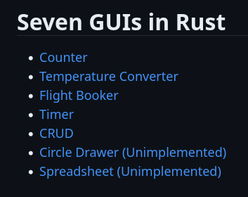
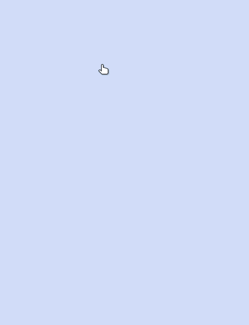
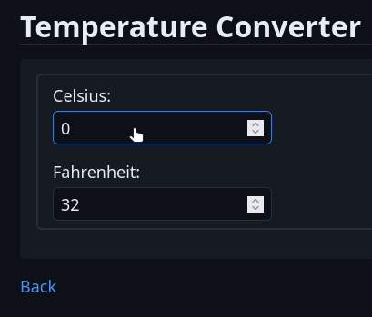
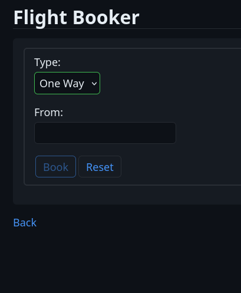
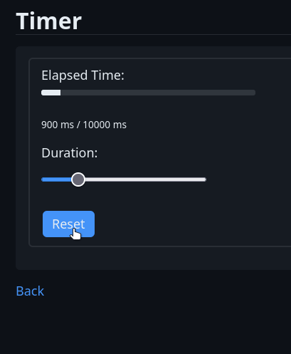
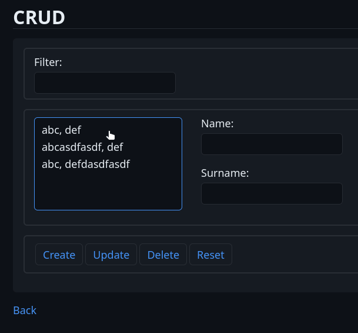

# 7GUIS-HARM (HTMX, Axum/AlpineJS, Rust, Maud)

Styled using `matcha.css`: https://matcha.mizu.sh/

## Demonstration

Index page:



1. Counter



2. Temperature Converter



3. Flight Booker



4. Timer



5. CRUD



6. Circle Drawer

TBA

7. Spreadsheet

TBA

## Development

Make sure you have `rust` and `cargo` and `bacon` installed.

```shell
bacon
```